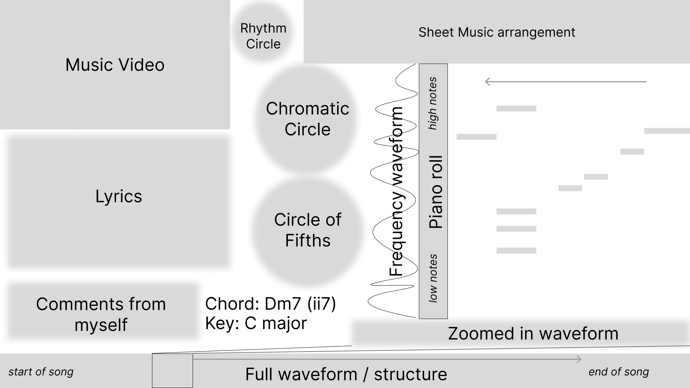

# harmonimation

A program for visualizing music theory of a given song.

Demo ():

Inspiration ():

Interested to chat about music or follow along with development?
Join my community Discord: <https://discord.gg/bseuGuKaZg>

## Features

Currently:

-   **Music animation widgets** created with [manim](https://github.com/ManimCommunity/manim),
    the animation engine powering [3Blue1Brown's math videos on YouTube](https://www.youtube.com/c/3blue1brown)
    -   Circle of 12 notes (arranged in both chromatic and Circle of 5ths)
        -   Connectors to visualize harmonic progressions
        -   Rotate during key changes
    -   Rhthm circle to visualize note timing within a measure
    -   Animated text for Key, Chord, and user notes
    -   Lyric text with syllable highlighting
-   **Programmatic parsing of sheet music** from `.musicxml` using [music21 library](https://www.music21.org/music21docs/about/what.html)
    -   Automatic chord inference (can write in chords if not correct)
    -   Lyric timing
-   **Declarative layout config file** for all music widgets and parsing behaviors

Planned for future:

-   Improvements to existing music widgets:
    -   12-note music circle
        -   Diatonic radials / pitch highlighting to emphasize in/out of key
        -   Showing all individual notes outside of main ring
        -   Add chord symbols for jazz chord extensions
        -   Show all current chord tones, not just root
    -   Rhythm circle
        -   Showing all individual notes outside of main ring
-   More music widgets:
    -   Piano roll
    -   Frequency spectrograms / graphs
    -   Sheet music with playhead
    -   Song structure/sections
    -   Vocal register
    -   Embedding other videos like music video
    -   Tonnetz lattice
-   Layout/Behavior config file improvements:
    -   Variable BPM
    -   Support other config formats like YAML / KDL
-   **Docker image** for rendering `harmonimation` without any local install

## Early design

## Local install

Not reliably proven, many need to fix your own setup issues.

Prerequisites:

1.  `ffmpeg`
    -   on mac, I've used `brew install ffmpeg`
1.  `uv`: <https://github.com/astral-sh/uv>

Installation steps:

1.  Clone this project
1.  Run `uv sync`
1.  Activate the `.venv` and/or select its interpreter in your IDE
1.  Install a LaTeX distro and the following packages on top of manim's guidance:
    `musicography musixtex-fonts stackengine newunicodechar`
    -   see <https://docs.manim.community/en/stable/installation/uv.html#step-2-optional-installing-latex>
    -   I tried to install `TinyTeX` on mac but I ran into issues with `dvisvgm` and missing files, do not recommend

Other issues:

-   On mac, I also needed to `brew install pkgconf` to get `pycairo` to install currectly during `uv sync`.
-   For some reason, I needed to manually make the `media/Tex` folder necessary for manim to create WIP LaTeX images.
