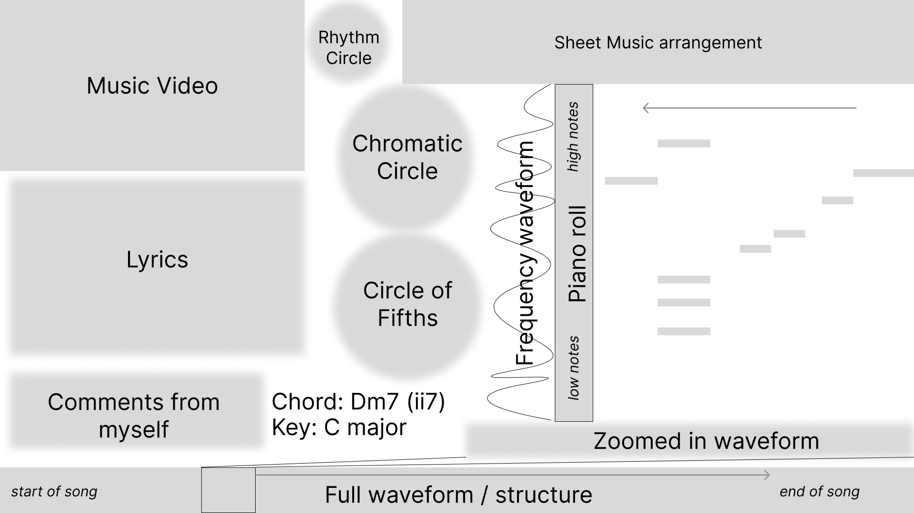

# harmonimation
A program for visualizing musical harmonies

## Features

Currently, very few:

-   [Shell wrapper script](https://github.com/PikaBlue107/harmonimation/blob/main/manim_wrapper/manim)
    to simplify using the [manim docker image](https://docs.manim.community/en/stable/installation/docker.html)
    -   I'm considering sharing this with the [Manim Community project](https://github.com/ManimCommunity/manim)
-   Literally some [toy examples](https://github.com/PikaBlue107/harmonimation/blob/main/renderer/main.py)
    of Manim animations from their [Getting Started page](https://docs.manim.community/en/stable/tutorials/quickstart.html).

## Early design

